<div align="center">

# ⚔️ Hallow Knight

### A faithful Hollow Knight fan-game built from scratch with Java and libGDX


</div>

---

<table>
  <tr>
    <td>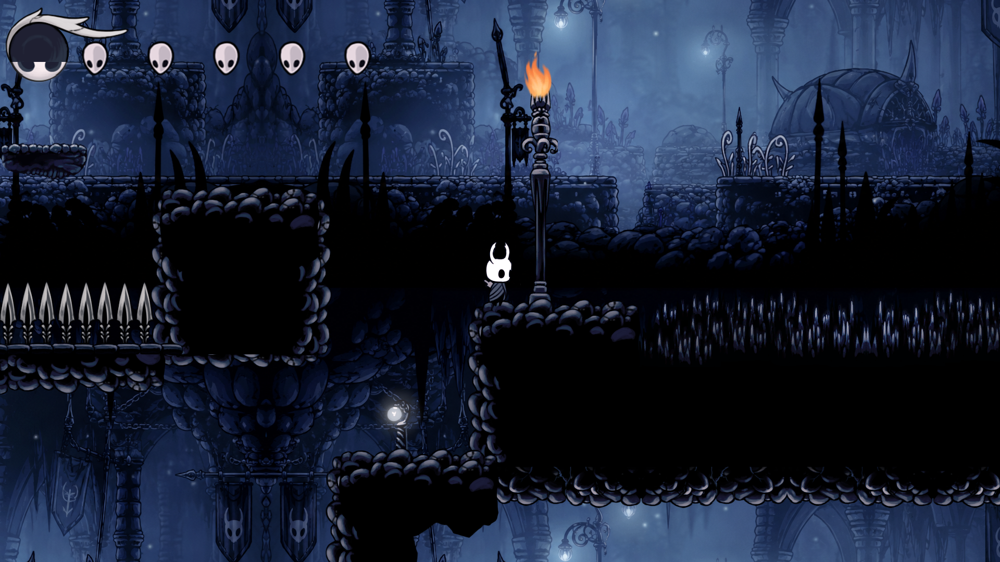</td>
    <td>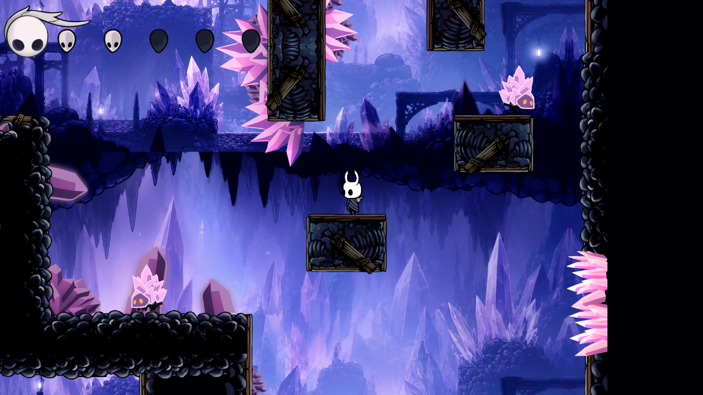</td>
  </tr>
</table>

**Hallow Knight** is a complete 2D action-platformer inspired by [Hollow Knight](https://www.hollowknight.com/), featuring a full combat system, multiple enemy types, a boss fight with multi-phase AI, a charm equipping system, Tiled-based maps, Box2D physics, and a polished UI with save slots and achievements.

---

## Table of Contents

- [Features](#features)
- [Screenshots](#screenshots)
- [Getting Started](#getting-started)
- [How to Play](#how-to-play)
- [Project Architecture](#project-architecture)
- [Game Mechanics](#game-mechanics)
- [Charms](#charms)
- [Enemies](#enemies)
- [Boss: False Knight](#boss-false-knight)
- [Build & Run](#build--run)

---

## Features

<details>
<summary><strong>Full Player Moveset</strong></summary>

- **Run** -- Left/Right arrow keys with smooth acceleration
- **Jump & Double Jump** -- Up arrow key, with a second mid-air jump
- **Wall Slide** -- Hold toward a wall while airborne to slide down slowly
- **Dash** -- Press `C` to dash forward with invincibility frames
- **Nail Combat** -- Press `X` to slash; combine with Up/Down arrows for directional attacks
- **Down Slash Pogo** -- Slash downward in the air to bounce off enemies and hazards
- **Focus (Heal)** -- Press `A` to channel soul and restore 1 mask
- **Vengeful Spirit** -- Press `S` to fire a soul projectile (costs 30 soul)
- **Howling Wraiths** -- Press `D` to unleash an upward soul burst (costs 30 soul)

</details>

<details>
<summary><strong>Combat & Physics</strong></summary>

- Full **Box2D physics** engine with gravity, collision detection, and 34 fixture types for precise hitbox management
- **Invincibility frames** with a visual blink effect after taking damage
- **Camera shake** on hits and boss attacks
- **Soul system** -- damage enemies to gain soul, spend soul to heal or cast spells

</details>

<details>
<summary><strong>Polished UI</strong></summary>

- **Main Menu** with animated logo and background music
- **4 Save Slots** with per-slot stats (play time, HP, soul)
- **In-Game HUD** -- animated health masks, soul orb widget
- **Pause Menu** -- continue, settings, guide, save & quit
- **Charm Inventory** -- equip up to 3 charms from a collection of 6
- **Options Screen** -- volume sliders, resolution presets, fullscreen toggle
- **Achievement System** -- 5 trackable achievements with persistence

</details>

---

## Screenshots

### Forgotten Crossroads

<table>
  <tr>
    <td>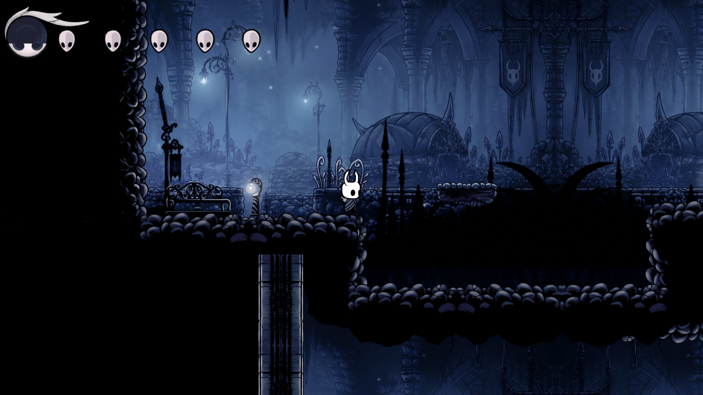</td>
    <td>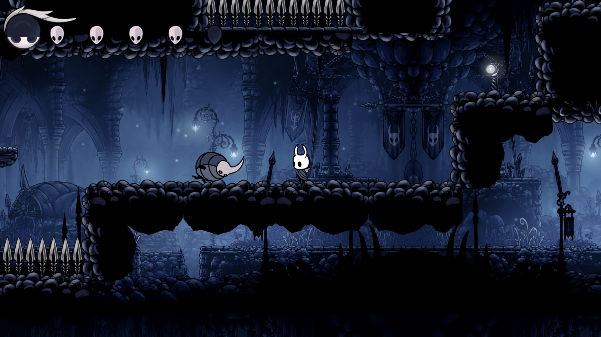</td>
  </tr>
  <tr>
    <td>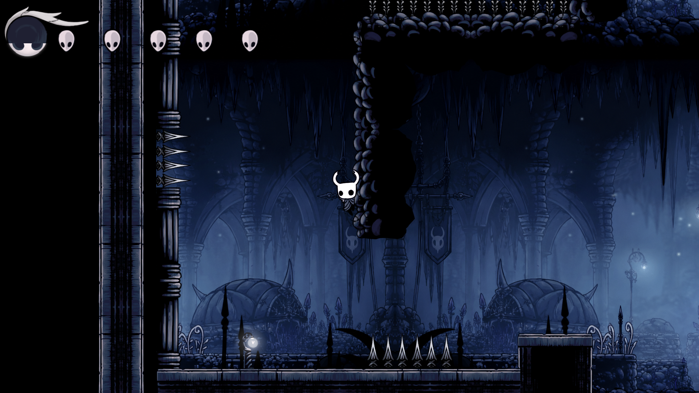</td>
    <td>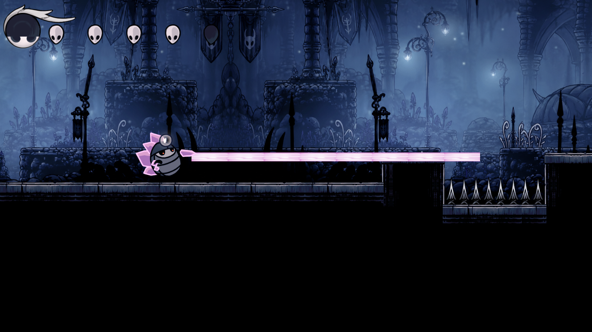</td>
  </tr>
  <tr>
    <td>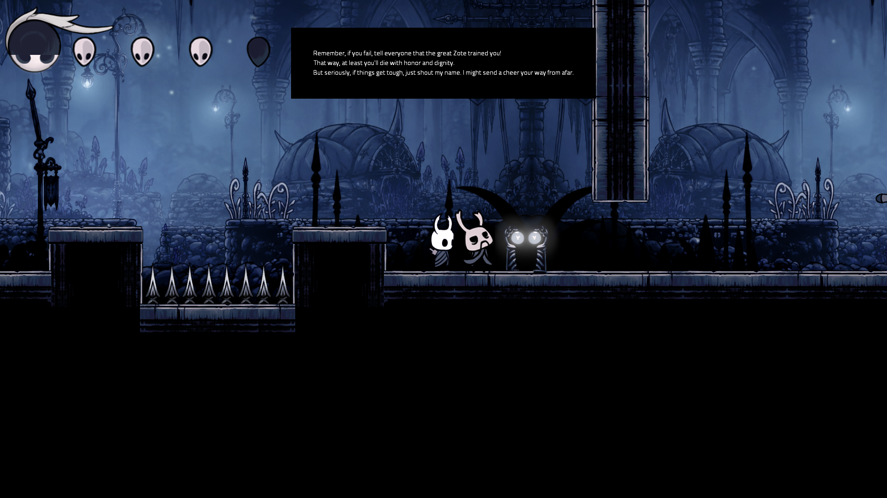</td>
    <td>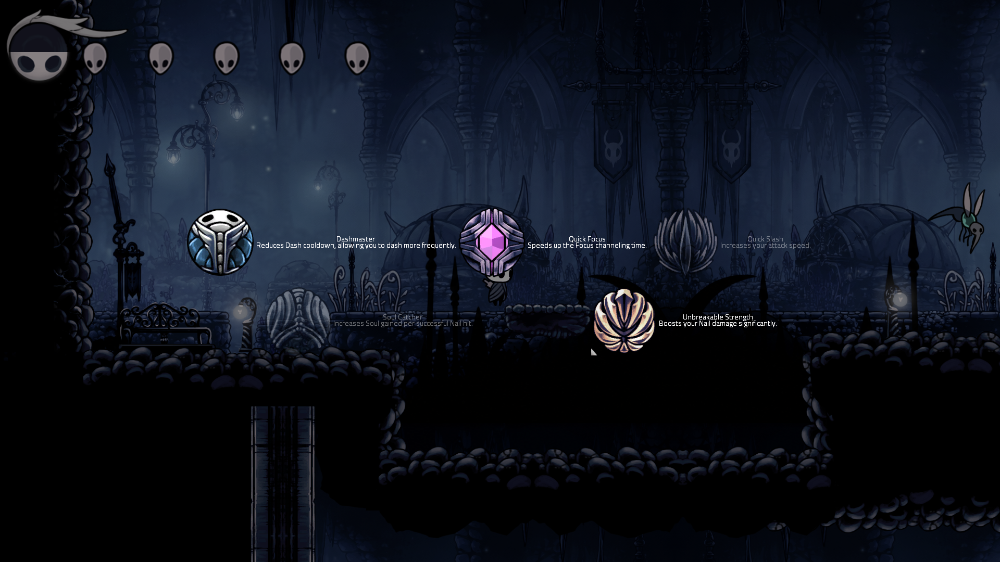</td>
  </tr>
</table>

### Crystal Peak

<table>
  <tr>
    <td>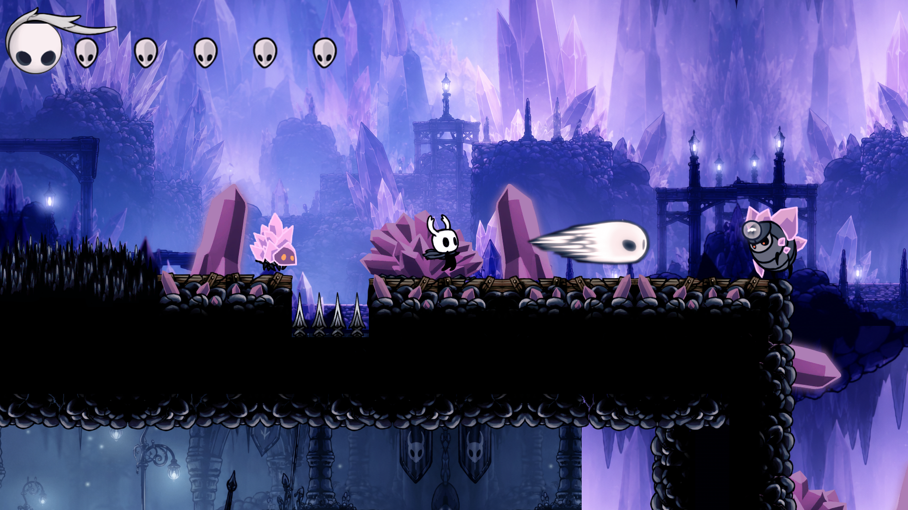</td>
    <td>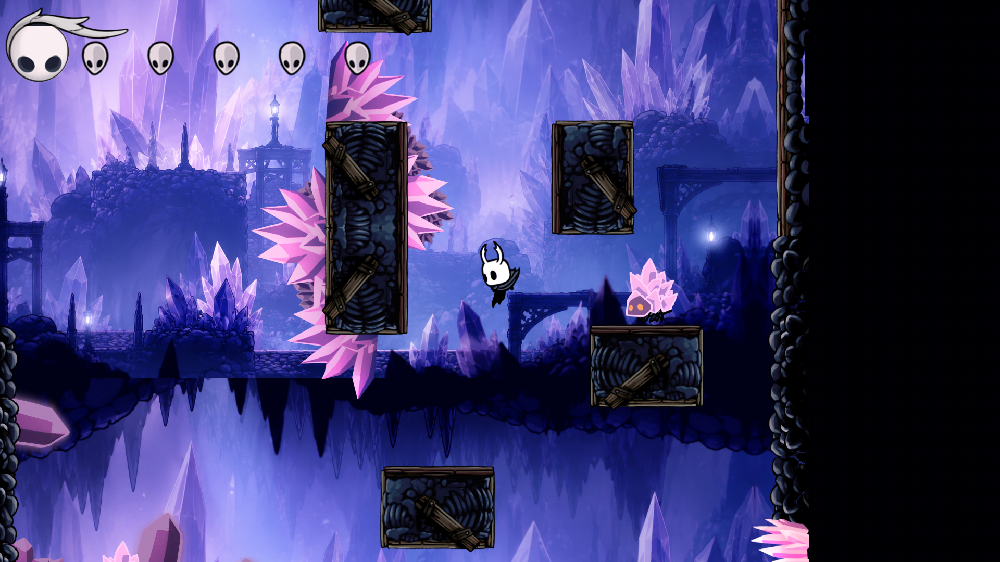</td>
  </tr>
  <tr>
    <td>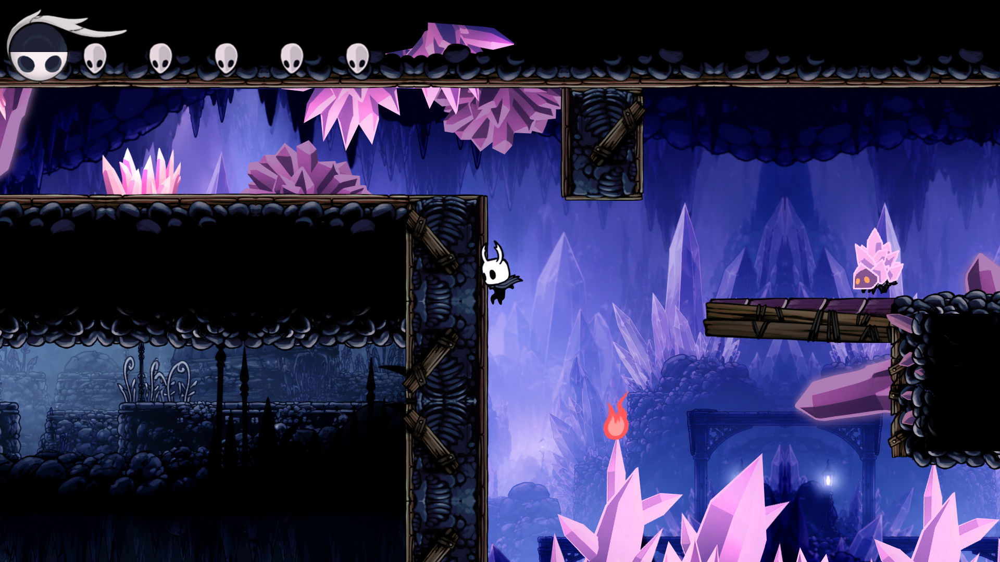</td>
    <td></td>
  </tr>
</table>

### Boss Fight: False Knight

<table>
  <tr>
    <td>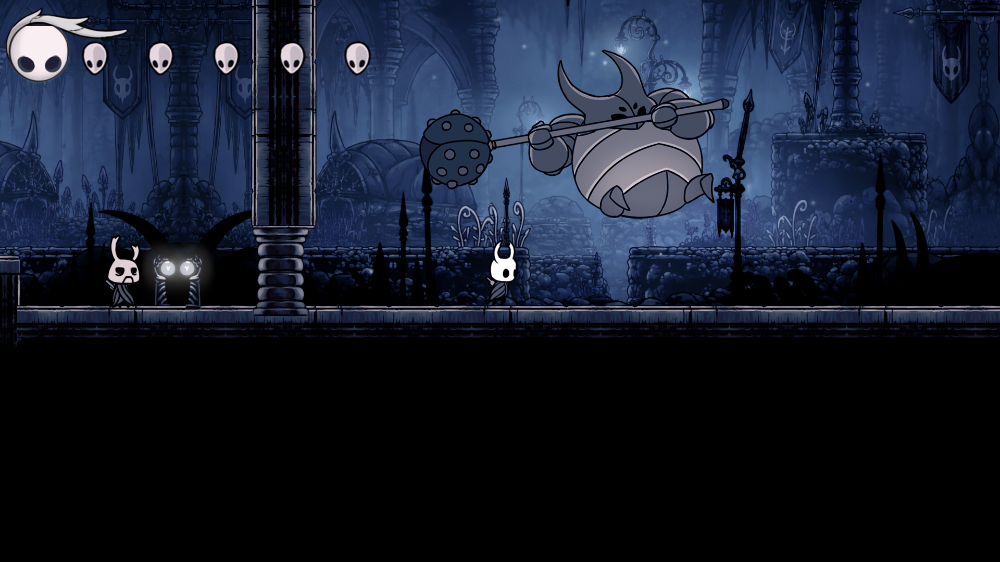</td>
    <td>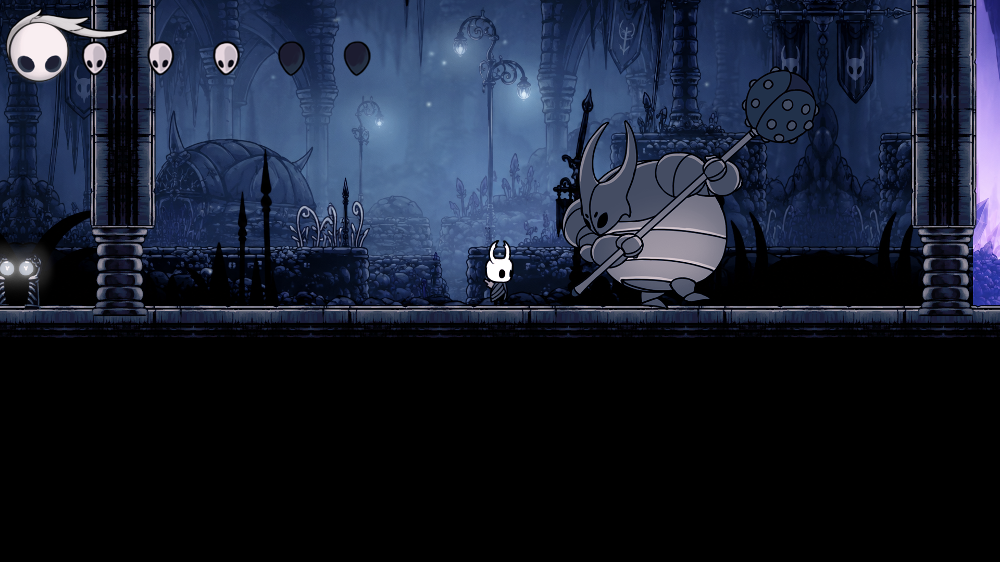</td>
  </tr>
  <tr>
    <td>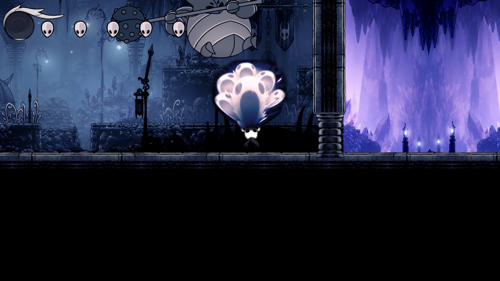</td>
    <td>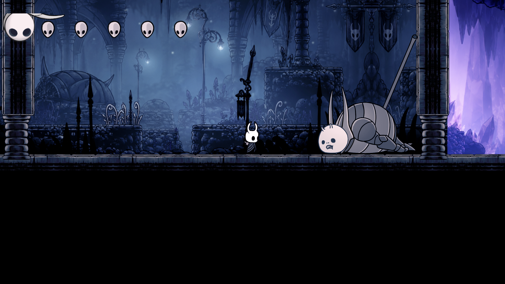</td>
  </tr>
  <tr>
    <td>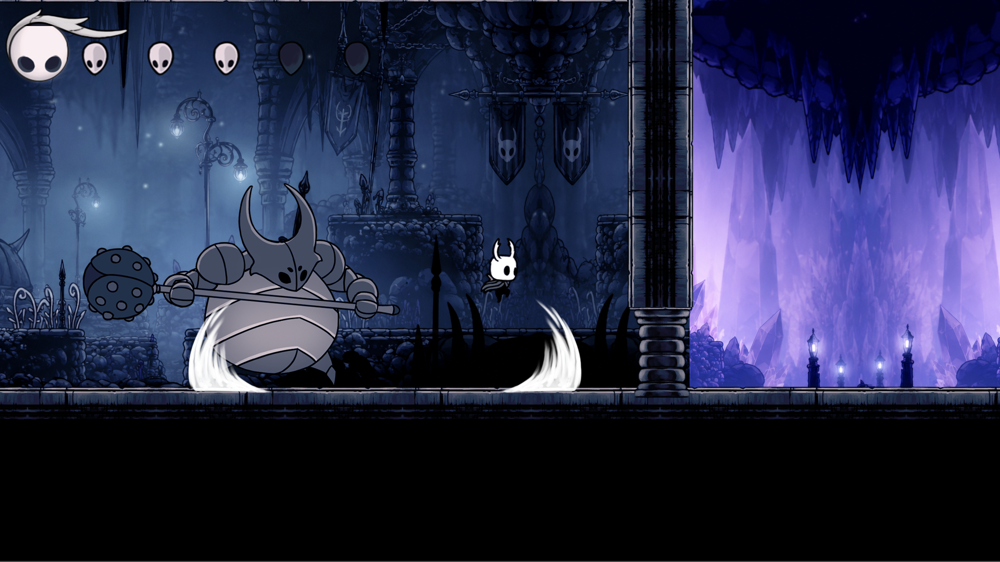</td>
    <td></td>
  </tr>
</table>

---

## Getting Started

### Prerequisites

- **Java 21** or higher
- **Gradle 8.x** (wrapper included)

### Installation

```bash
git clone https://github.com/your-username/HallowKnight.git
cd HallowKnight
```

### Running the Game

```bash
# Linux / macOS
./gradlew lwjgl3:run

# Windows
gradlew.bat lwjgl3:run
```

---

## How to Play

### Controls

| Key | Action |
|-----|--------|
| `Left` / `Right Arrow` | Move |
| `Up Arrow` | Jump / Double Jump |
| `Down Arrow` | Look Down / Down Slash |
| `X` | Nail Attack (Slash) |
| `C` | Dash |
| `A` | Focus (Heal) |
| `S` | Vengeful Spirit (Soul Projectile) |
| `D` | Howling Wraiths (Soul Burst) |
| `I` | Open Inventory (Charm Menu) |
| `P` | Pause Menu |
| `ESC` | Pause Menu |

### Debug / Cheat Codes

| Shortcut | Action |
|----------|--------|
| `CTRL + B` | Teleport to Boss Arena |
| `CTRL + Q` | Toggle Spectator Mode (Free Camera) |
| `CTRL + H` | Emergency Heal (+1 HP) |
| `CTRL + R` | Refill Soul to Max |
| `CTRL + G` | Toggle God Mode |

---

## Project Architecture

```
HallowKnight/
├── core/                          # Shared game logic (all platforms)
│   └── src/com/HallowKnight/
│       ├── HallowKnight.java      # Entry point & Game singleton
│       ├── Controller/            # Game loop, input, collision dispatching
│       │   ├── GameController.java
│       │   ├── KnightController.java
│       │   ├── ContactController.java
│       │   └── Managers/          # Asset, Save, Screen, Audio managers
│       ├── Model/
│       │   ├── Knight/            # Player entity, 16-state FSM, Nail weapon
│       │   ├── Enemies/           # 4 enemy types (Ground, Hornhead, Mosquito, Crystallized)
│       │   ├── FalseKnight/       # Boss with 2-phase AI, arena barriers
│       │   ├── NPCs/              # Zote NPC
│       │   ├── Charms/            # 6 equippable passive charms
│       │   ├── Effects/           # Projectiles, decorative effects
│       │   ├── Map/               # TiledMap -> Box2D body initialization
│       │   └── GameCamera, GameState, Settings, FixtureType
│       └── View/
│           ├── *Screen.java       # 7 screens (Menu, Game, Options, etc.)
│           └── Modals/            # HUD, PauseMenu, Inventory, SoulOrb
├── lwjgl3/                        # Desktop launcher (LWJGL3)
├── assets/                        # Tiled maps, sprites, animations, audio, UI
├── Pics/                          # Screenshots for README
└── build.gradle
```

### Tech Stack

| Component | Technology |
|-----------|-----------|
| Language | Java 21 |
| Framework | libGDX 1.14.1 |
| Physics | Box2D (via libGDX) |
| Maps | Tiled (TMX) via `TmxMapLoader` |
| Fonts | FreeType (via libGDX) |
| UI | Scene2D + TenPatch 5.2.3 |
| Build | Gradle 8.x |
| Platform | LWJGL3 (Desktop) |

---

## Game Mechanics

### Soul System

The Knight collects **soul** by dealing damage with the nail. Soul is displayed as an orb in the HUD and is consumed by:

- **Focus (Heal)** -- 30 soul to restore 1 mask
- **Vengeful Spirit** -- 30 soul, fires a horizontal projectile (3 damage)
- **Howling Wraiths** -- 30 soul, 3 upward bursts (6 damage each)

### Health (Masks)

The Knight starts with **5 masks** (HP). Taking damage removes 1 mask and triggers invincibility frames. At 0 masks, the Knight dies, and progress is saved for respawn.

### Achievements

| Achievement | Condition |
|-------------|-----------|
| Game Completion | Defeat the False Knight |
| Speed Run | Complete the game in under 3 minutes |
| True Hunter | Kill at least one of every enemy type |
| False Knight | Defeat the False Knight |
| No Damage | Complete the game without taking any damage |

---

## Charms

Equip up to **3 charms** simultaneously from the inventory screen (`I`).

| Charm | Effect |
|-------|--------|
| **Dashmaster** | Reduces dash cooldown to 1/3 (1.5s -> 0.5s) |
| **Quick Focus** | Halves focus channel duration (1.5s -> 0.75s) |
| **Quick Slash** | Reduces slash cooldown to 1/4 (0.5s -> 0.125s) |
| **Soul Catcher** | Doubles soul gained per hit (11 -> 22) |
| **Unbreakable Strength** | Doubles nail damage (1 -> 2) |
| **Heavy Blow** | *(Coming soon)* |

---

## Enemies

| Enemy | HP | Behavior |
|-------|----|----------|
| **Crystal Crawler** | 2 | Patrols ground, turns at walls and edges |
| **Husk Hornhead** | 5 | Patrols, enters angry mode and chases the player when nearby |
| **Mosquito** | 4 | Hovers in the air, anticipates then dive-bombs the player |
| **Crystal Guardian** | 7 | Stationary, fires a laser beam at the player when enraged |

---

## Boss: False Knight

A fully implemented boss fight with **200 HP** and **two phases**:

**Phase 1** (100-200 HP):
- Mace Slam, Charge Run, Offensive Leap, Defensive Leap

**Phase 2** (1-99 HP) -- faster cooldowns, new attack:
- Heavy Mace Slam with shockwave projectiles

The fight features arena barriers, weighted random AI that adapts to player distance, a stun phase with vulnerability windows, and a death sequence with achievement tracking.

---

## Build & Run

```bash
# Build the project
./gradlew build

# Run the game
./gradlew lwjgl3:run

# Build a runnable JAR
./gradlew lwjgl3:jar
# Output: lwjgl3/build/libs/HallowKnight-1.0.0.jar

# Clean build artifacts
./gradlew clean

# Generate asset list
./gradlew generateAssetList
```

---

<div align="center">

Built with passion for the world of Hallownest.

</div>
